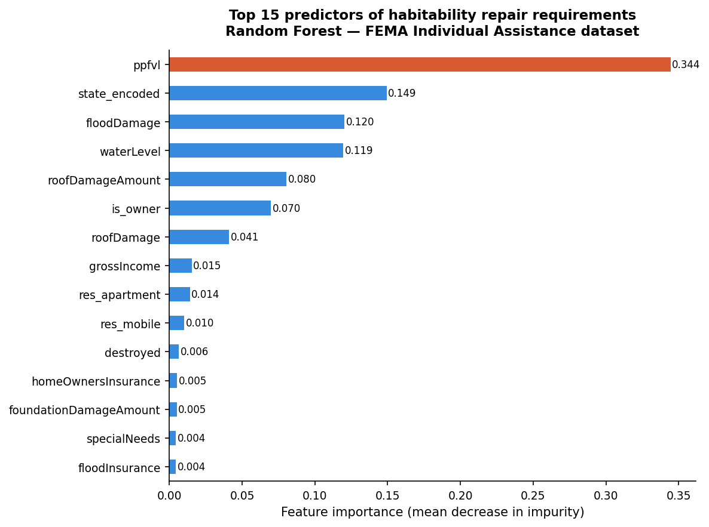

# FEMA Data Can Predict Which Disaster Survivors Need Help Most — Before an Inspector Ever Arrives

## When minutes matter, data can lead the way

Every year, hundreds of thousands of American families register for federal disaster housing assistance after hurricanes, floods, and storms damage their homes. They fill out forms. They wait — for an inspector to arrive, for an eligibility decision, and for help. In large-scale disasters, that wait can stretch from days into weeks. This project asks a simple but powerful question: what if we didn’t have to wait?

## The Problem: A System Built to React, Not to Predict

When a major disaster strikes, FEMA opens registration for Individual Assistance — a program that serves millions of households and distributes billions of dollars in aid each year. However, the process is fundamentally reactive. An inspector must visit each home before FEMA can determine whether it requires habitability repairs — the key decision that determines whether a family can safely return.

With inspectors spread across large disaster zones, inspection capacity becomes a bottleneck. As a result, households with the greatest need are not always prioritized first. Research shows that lower-income households are less likely to receive assistance and often receive less when they do, highlighting both delays and inequities in the system.

## The Solution: Let the Data Help Decide Who Goes First

Using FEMA’s historical records — over 6 million household registrations from major disasters across Florida, Texas, Puerto Rico, and Louisiana — this project trains a machine learning model to predict whether a household will require habitability repairs using only the information available at the time of registration. These inputs include household size, income, insurance status, housing type, and early damage indicators.

The model correctly identifies households that will need repairs about 81% of the time, providing an early signal of which families are most at risk. A second model estimates the expected cost of property damage, explaining a large portion of the variation in repair outcomes.

While the model is trained on historically inspected households, it is designed to be applied at the moment of registration, allowing predictions to be generated days before an inspector arrives.

Together, these tools enable emergency managers to prioritize inspection schedules, allocate resources more effectively, and identify high-need households earlier in the response process.

## What The Data Revealed

The analysis uncovered clear geographic and structural patterns in disaster damage outcomes. Louisiana had the highest habitability repair rate, with a majority of inspected households requiring repairs, while states like Florida experienced significantly lower rates.

Homeowners experienced higher repair rates than renters, reflecting the structural vulnerability of certain housing types to severe weather. Flood damage emerged as one of the strongest indicators of repair needs, with affected households far more likely to require habitability repairs than those without flooding.

The chart below highlights the most important factors driving these predictions.

## Chart: what predicts whether a home needs repairs?

The feature importance chart from the Random Forest model indicates that personal property loss (`ppfvl`) is the most significant predictor of habitability repair requirements, followed by `geographic location` (state_encoded), `flood damage`, and `water level`.

Since these indicators are typically self-reported or estimated during the initial registration process, the model can generate habitability predictions the moment a household submits their FEMA application. This provides critical insight days before a physical inspection even takes place.
